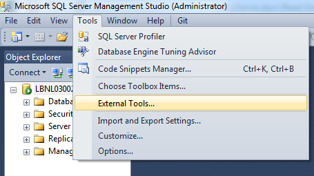

# SQL source control with GIT

Implement a source control for SQL Server Management Studio (SSMS).

## Getting Started

These instructions will help you to implement a source control integration for SSMS.

### Prerequisites

* Any version of Microsoft SQL Server Management Studio
* Git installed (Follow the instruction from the website https://git-scm.com/book/en/v2/Getting-Started-Installing-Git)

## SQL Server Management Studio - External tools

More info : https://technet.microsoft.com/en-us/library/ms177402(v=sql.110).aspx 

### Implementation

Add an external tool by Git command.

#### Define a custom Git editor

Execute the following command in your Git bash

*git config core.editor "'C:\Program Files (x86)\Notepad++\notepad++.exe' -multiInst -notabbar -nosession -noPlugin"*

#### External tool - Git commit

> A text editor must be defined for Git commit comments. See section *"Define a custom Git editor"*

| Name | Value |
| ------ | ------ |
| Name    | &Git commit |
| Command | C:\windows\SysWOW64\cmd.exe|
| Arguments | /c ""C:\Program Files\Git\bin\sh.exe" --login -i -c "git add -A; git commit -e"" |
| Initial directtory | $(ItemDir) |

#### External tool - Git push

| Name | Value |
| ------ | ------ |
| Name    | &Git push |
| Command | C:\windows\SysWOW64\cmd.exe|
| Arguments | /c ""C:\Program Files\Git\bin\sh.exe" --login -i -c "git push"" |
| Initial directtory | $(ItemDir) |

#### External tool - Git pull

| Name | Value |
| ------ | ------ |
| Name    | &Git pull |
| Command | C:\windows\SysWOW64\cmd.exe|
| Arguments | /c ""C:\Program Files\Git\bin\sh.exe" --login -i -c "git pull"" |
| Initial directtory | $(ItemDir) |

## Authors

* **Lesly Bernaola** - [email](leslybernaola@hotmail.com)
