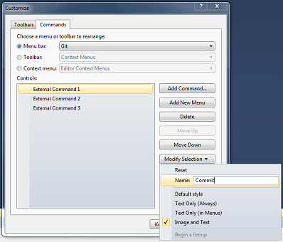
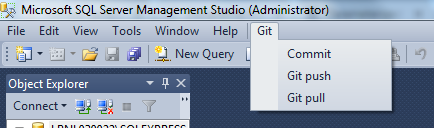

# SQL source control with GIT

Implement a source control for SQL Server Management Studio (SSMS).

## Getting Started

Below instructions will help you to implement a source control integration for SQL Server Management Studio (SSMS).

#### What is SQL Server Management Studio (SSMS) - External tools ?

You can launch any Microsoft Windows or Microsoft .NET Framework application from SSMS Tools menu.

More info : https://technet.microsoft.com/en-us/library/ms177402(v=sql.110).aspx 


### Prerequisites

* Any version of Microsoft SQL Server Management Studio (SSMS)
* [Git](https://git-scm.com/book/en/v2/Getting-Started-Installing-Git)

### Implementation

#### Define a custom Git editor

Execute the following command in your Git bash, this will be used as an input tool, e.g., commit message

```git config core.editor "'C:\Program Files (x86)\Notepad++\notepad++.exe' -multiInst -notabbar -nosession -noPlugin"```

#### Define an External tool per Git command

##### Git commit

| Name | Value |
| ------ | ------ |
| Name    | &Git commit |
| Command | C:\windows\SysWOW64\cmd.exe|
| Arguments | `/c ""C:\Program Files\Git\bin\sh.exe" --login -i -c "git add -A; git commit -e""` |
| Initial directory | $(ItemDir) |


##### Git push

| Name | Value |
| ------ | ------ |
| Name    | &Git push |
| Command | C:\windows\SysWOW64\cmd.exe|
| Arguments | `/c ""C:\Program Files\Git\bin\sh.exe" --login -i -c "git push""` |
| Initial directory | $(ItemDir) |


##### Git pull

| Name | Value |
| ------ | ------ |
| Name    | &Git pull |
| Command | C:\windows\SysWOW64\cmd.exe|
| Arguments | `/c ""C:\Program Files\Git\bin\sh.exe" --login -i -c "git pull""` |
| Initial directory | $(ItemDir) |

### Customization

Customize the Git external tools.


#### Add a Git menu

1.	In SSMS, go to Tools menu, then select Customize...
2.	In the “Commands” tab, select “Menu bar” in the “Menu Bar” list
3.	Click in the “Add New Menu” button
4.	Select “New Menu”
5.	Click in the “Modify Selection” button
6.	In the “Modify Selection” box, enter the new menu name e.g. “Git”, and click in the “Begin a Group” button. 


#### Add a sub-menu for each Git command

1.	In the “Commands” tab, select "Git" in the "Menu Bar" list
2.	Click in the “Add Command” button
3.	Select “External command N”, where N corresponds to the command creation order e.g. "Git commit" command is the "External command 1", then rename it with the corresponding command name.


4. Rename each Git command



5. The result looks like



### Usage examples

#### Existing file in remote repository ?

1. Clone your repository on your computer using "`git clone [<repository>]`"
2. Open your .sql file in SSMS
3. Modify and save it
4. Commit using "Commit" menu under "Git" menu (This command adds all the modified files and commit them)
5. Push it using "Git push" menu under "Git" menu

#### New file ?

1. Clone your repository on your computer using "`git clone [<repository>]`"
2. Create your .sql file in SSMS
3. Save it under your local git repository folder
4. Commit using "Commit" menu under "Git" menu (This command adds all the modified files and commit them)
5. Push it using "Git push" menu under "Git" menu

#### Delete file(s) from remote repository ?

1. Clone your repository on your computer using "`git clone [<repository>]`"
2. Delete the file(s) from your file system
3. Commit using "Commit" menu under "Git" menu (This command adds all the modified files and commit them)
4. Push the changes using "Git push" menu under "Git" menu

## Authors

* **Lesly Bernaola** - [email](leslybernaola@hotmail.com)
